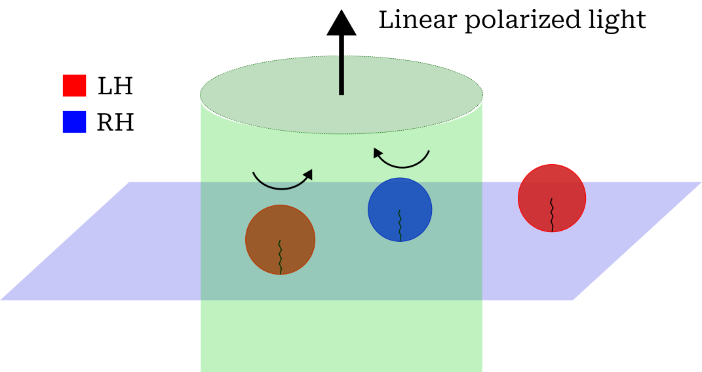

# Research

**Navigation:** [Home](index.html) · [Publications](publications.html) · [Open science](open-science.html) · [Contact](contact.html)

---

## OPS-CLC Project
OPS-CLC investigated chiral light–matter interaction in cholesteric liquid-crystal droplets. The core idea was that the two circular components of a linearly polarised optical field may generate **opposite-sign optomechanical torques** on droplets of opposite handedness, potentially enabling contact-free discrimination mechanisms.

## Experimental platform
A dedicated optofluidic and optical setup was developed to:
- illuminate droplets under controlled, near plane-wave conditions,
- image and analyse droplet orientation and dynamics using polarising microscopy,
- explore strategies to stabilise internal defect orientation and improve reproducibility.

## Key physical challenge
During experiments, the internal defect structure (disclination line) proved difficult to align and stabilise reproducibly, and hydrodynamic coupling with the surrounding fluid strongly influenced the observed dynamics. This revealed an important limitation for droplet-based torque readout under uniform illumination and motivated complementary approaches to defect control in related liquid-crystal systems.

## Concept figure

*Conceptual illustration of the OPS-CLC project. Linearly polarised plane-wave light illuminates a microfluidic chamber containing cholesteric liquid-crystal droplets of opposite handedness (LH and RH). Chiral light–matter interaction leads to opposite optical torques and rotational dynamics.*

